# Developer Guide

## Acknowledgements

{list here sources of all reused/adapted ideas, code, documentation, and third-party libraries -- include links to the original source as well}

## **Design**

Firstly, the overall class diagram of TASync is provided below. It gives a quick overview of the key classes that work with one another
to create a functional TASync program and is not fully comprehensive. The focus of this diagram is to provide a high-level understanding of the system's structure,
with further details, such as class methods, attributes, and specific interactions omitted. This serves as a foundation for understanding the
key components and how they contribute to the overall functionality of TASync.

### **Command handling component**
**Overview**
- The command handling component is responsible for interpreting user inputs, creating the corresponding command objects, and executing them with access to the necessary application data. This structure supports extensibility and separates concerns, making the command system more modular and maintainable.

**Component Breakdown**
- `CommandLoopHandler`
  - This is the central controller of the command execution flow.
  - It contains references to key components like:
  - `UI` – for user interaction,
  - `TaskList`, `StudentList`, `TutorialClassList` – data stores for application logic,
  - `AttendanceFile` and `DataManager` – for persistent storage.
  - The method `runCommandLoop()` drives the main interaction cycle, prompting and processing commands continuously.

- `CommandParser`
  - Responsible for parsing the raw user input.
  - It splits the input into `parts[]`, typically separating the command word from the arguments.
  - `getParts()` returns these segments to be used for command construction.

- `CommandHandler`
  - Takes the parsed parts and manages the process of executing the command.
  - Internally calls `CommandFactory` to generate the correct command object based on the input.
  - `runCommand()` initiates this process and delegates execution accordingly.
- `CommandFactory`
  - This class uses a factory pattern to determine which concrete command object to return.
  - Given a command string, it returns the corresponding command object that implements the `Command` interface. 
  - This decouples command creation logic from other parts of the system.
- `XYZCommands`
  - This is a placeholder representing all concrete command classes (e.g., `TodoCommand`, `ListTaskCommand`, `MarkTaskCommand`, etc.).
  - Each of these implements a common `Command` interface and defines how that specific command modifies the data (like adding a task or marking it as done).

### **Data management component**
**Overview**
 - The data management component handles the loading and saving of application data such as tutorials, attendance, and marks. It abstracts away file operations through the use of well-defined interfaces, supporting a modular and extensible structure. This design ensures data persistence across sessions and simplifies file I/O logic. 

**Component Breakdown**
- `DataManager`
  - The central coordinator for all data-related operations.
  - Responsible for: Defining file paths and calling appropriate methods to load and save data.
  - Public methods include: 
    - `loadTutorials()`, `loadAttendanceFiles()`, `loadMarks()` – for reading. 
    - `saveTutorials()`, `saveAttendanceFile()`, `saveMarksList()` – for writing.
    - `ensureFileAndDirectoryExist()` – utility to ensure required file structures exist before usage.
  - Delegates the low-level reading/writing to classes that implement the `FileLoader<T>` and `FileSaver<T>` interfaces.
- `DataLoader`
  - Serves as a utility helper that wraps calls to DataManager to load specific types of data.
  - Offers methods like: `loadTutorialClasses()` and `loadAttendanceFile(tutorialList)`.
- `FileLoader<T> Interface`
  - A generic interface for all **file loading** logic.
  - Classes implementing this interface must define `loadFromFile()` which returns an object of type `T`.
  - Implementations could include: `AttendanceFileFileLoader`, `StudentFileLoader`, etc.
- `FileSaver<T> Interface`
  - A generic interface for file saving logic.
  - Classes implementing this interface must define `saveToFile(data: T)`. 
  - Implementations could include: `TutorialClassFileSaver`, `AttendanceFileFileSaver`, etc.

## **implementation**

This section describes some important details on how certain features in TASync are implemented.

### Command Package Structure

The `command` package contains the following sub-packages:

- `attendancelistcommands` - Handles commands related to attendance lists.
- `commandhandler` - Manages the processing and execution of various commands
- `student commands` - Implements commands specific to student-related operations
- `taskcommands` - Contains commands for managing tasks
- `tutorialcommands` - Handles tutorial-related commands

### Command Handler

#### 1. CommandParser

The `CommandParser` is responsible for breaking down user input into a **command keyword** and its corresponding **arguments**.

#### Implementation Details

- Extracts the first word as the command keyword (e.g., `newstudent`, `delete`) and treats the remainder as arguments.
- Trims and sanitizes input to ensure compatibility across all command handlers.
- Throws relevant exceptions if input is malformed or empty.

#### Operations

- `CommandParser(String input)`
  - Parses the keyword and arguments from user input and saves in attribute: String[] parts
  - Handles edge cases like extra whitespace and missing commands.
- `getParts()`
  - Returns parts, an array of String which is the parsed command.

---
#### 2. CommandHandler

The `CommandHandler` orchestrates the end-to-end command processing — from parsing to execution.

#### Implementation Details
- Delegates command resolution to `CommandFactory`, and execution to the returned `Command` instance.
- Accepts relevant data structures such as `TaskList`, `TutorialClassList`, and `AttendanceFile` as input to command execution.

#### Operations

- `CommandHandler(T list, String parts)`
  - Saves `list` to attribute
  - Delegates command creation to `CommandFactory` and saves the `Command` instance returned
  - save relevant command details `parts`
- `runCommand()`
  - calls .execute() method of the `Command` instance on the `list` saved based on `parts`.

---

#### 3. CommandFactory

The `CommandFactory` is responsible for returning the correct command object for execution.

#### Implementation Details

- Implements the **Factory Design Pattern** to instantiate command classes without exposing their construction logic to external classes.
- Maps each supported command keyword (e.g., `addstudent`, `listtasks`, `newtutorial`) and returns its corresponding command object to the caller class.
- Throws descriptive exceptions if an unrecognized command is provided.

#### Operations

- `CommandFactory.getCommand(String keyword)`
  - Returns a new instance of the corresponding command class that implements `Command<T>`.
  - Commands are registered in the factory using a `switch-case` or a command map for maintainability.
  - Supports all domains: `studentcommands`, `taskcommands`, `tutorialcommands`, `attendancelistcommands`, `markscommands`.

---

#### Benefits of the Design

- **Modular & Extensible:** Commands can be added or removed without changing the handler logic.
- **Polymorphic Execution:** All commands implement a common interface `Command<T>`, simplifying invocation logic.
- **Robust Error Handling:** Clearly separates exceptions thrown during parsing, command creation, and execution.
- **Testable:** Each component (`Parser`, `Factory`, `Handler`) can be unit tested independently.

### Operations of the three classes in CommandLoopHandler:
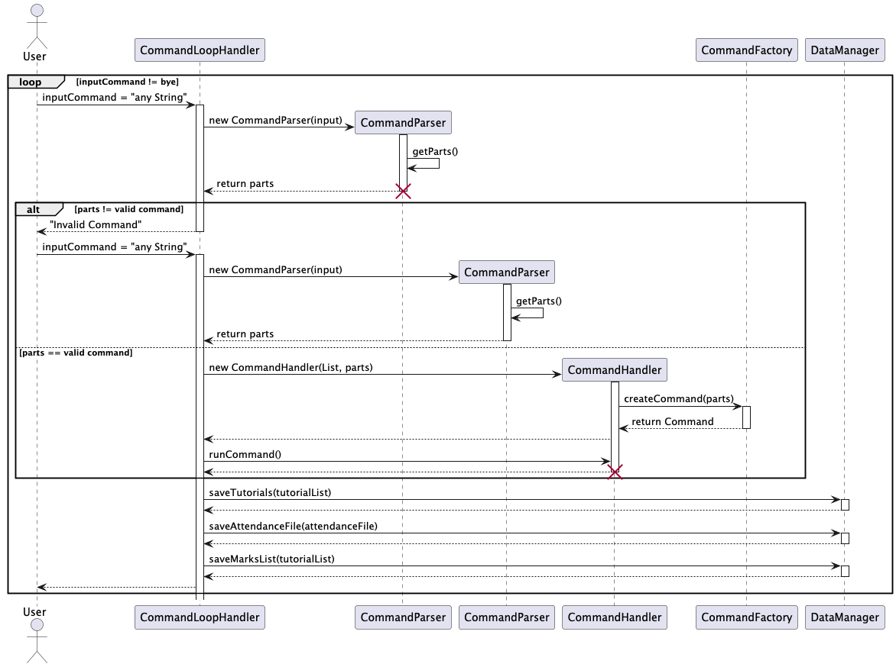
  - User inputs command to `CommandLoopHandler`, which will loop while user does not input `bye`
  - the `commandLoopHandler` first Parses the command into parts using `CommandParser`
  - if the parts are not valid command, `CommandLoopHandler` repeated requests for input command till it is valid
  - if parts are valid command, `CommandLoopHandler` creates `CommandHandler` with list based on command and parts
  - `CommandHandler` uses `createCommand()` method from `CommandFactory` to generate `Command` Object
  - The CommandLoopHandler then calls `runCommand()` method in `CommandHandler`
  - CommandHandler then runs the Command
### Tutorial Commands

#### 1. NewTutorialCommand

The `NewTutorialCommand` is part of the `tutorialcommands` package and is responsible for adding a new tutorial class
to the tutorial class list. This operation ensures that the tutorial class is valid, does not duplicate an
existing class, and has the correct details.

#### Implementation Details

The `NewTutorialCommand` class implements the `Command<TutorialClassList>` interface. It is responsible for parsing
the input, validating the tutorial details, and adding the new tutorial to the list.

#### Operations

The class implements the following main operation:

- `NewTutorialCommand#execute()`
  - **Parses the input** to extract the tutorial details: name, day of the week, start time, and end time.
  - **Validates the input** to ensure:
    - The input is not empty or invalid.
    - The day of the week is a valid integer between 1 and 7.
    - The start and end times are in a valid format.
    - The tutorial is not a duplicate of an existing tutorial in the list.
  - **Checks if a duplicate tutorial exists** by comparing the tutorial name, day of the week, start time, and end time.
  - If a duplicate is found, throws a `TASyncException.duplicateTutorial()` exception.
  - If the tutorial details are valid and no duplicates are found, creates a new `TutorialClass` object.
  - Adds the new tutorial to the tutorial class list.
  - Prints a success message upon successful addition of the tutorial.
  - If the input or any other data is invalid, catches and handles exceptions and displays appropriate error messages.

#### 2. DeleteTutorialCommand

The `DeleteTutorialCommand` is part of the `tutorialcommands` package and is responsible for removing a tutorial class
from the tutorial class list by its name. This operation ensures that a tutorial class is deleted if it exists,
and provides appropriate feedback if the class does not exist in the list.

#### Implementation Details

The `DeleteTutorialCommand` class implements the `Command<TutorialClassList>` interface. It is responsible for parsing
the input, validating it, and deleting the corresponding tutorial class from the list.

#### Operations

The class implements the following main operation:

- `DeleteTutorialCommand#execute()`
  - **Validates the input** to ensure that the tutorial class code is not empty or invalid.
  - **Searches for the tutorial class** by its name (code) in the tutorial class list.
  - If the tutorial class is found, it is removed from the list.
  - **Handles cases where no tutorial class is found** with the specified code and displays a message indicating that the tutorial class does not exist.
  - **Error handling**: Catches any exceptions that occur during the execution and displays the error message.

#### 3. ListTutorialStudentsCommand

The `ListTutorialStudentsCommand` class implements the `Command<TutorialClassList>` interface. It is responsible for
parsing the input, validating the tutorial name, and listing the students enrolled in the specified tutorial class.

#### Implementation Details

The `ListTutorialStudentsCommand` class implements the `Command<TutorialClassList>` interface. It is responsible for
parsing the input, validating the tutorial name, and listing the students enrolled in the specified tutorial class.

#### Operations

The class implements the following main operation:

- `ListTutorialStudentsCommand#execute()`
  - **Validates the input** to ensure the tutorial name is not empty or invalid.
  - **Searches for the tutorial class** by its name within the list of tutorial classes.
  - If the tutorial class is found, it retrieves the list of students enrolled in the tutorial class.
  - If there are no students enrolled, a message is displayed indicating that the tutorial has no students.
  - If students are found, their details are printed.
  - **Error handling**: If the tutorial name does not match any existing tutorial class or the input is invalid,
    an exception is thrown, and an error message is displayed.

#### 4. ListUpcomingTutorialsCommand

The `ListUpcomingTutorialsCommand` is part of the `tutorialcommands` package and is responsible for listing all upcoming
tutorial sessions from the current date until a given end date. The tutorials are displayed with their names, dates, and times.
If the input is invalid or any exceptions occur, appropriate error messages are displayed.

#### Implementation Details

The `ListUpcomingTutorialsCommand` class implements the `Command<TutorialClassList>` interface. It handles parsing the input,
validating the date, and listing the upcoming tutorials that fall within the specified date range.

#### Operations

The class implements the following main operation:

- `ListUpcomingTutorialsCommand#execute()`
  - **Validates the input**: Ensures the end date string is not null or empty.
  - **Parses the input date**: Converts the input end date string into a `LocalDate` format using `DateTimeFormatterUtil.parseDate()`.
  - **Calculates the first upcoming tutorial date**: Determines the next occurrence of the first tutorial class based on the current date and the day of the week.
  - **Lists tutorials**: Iterates through the tutorial classes, printing their names, dates, start times, and end times for each tutorial class that happens before the end date.
  - **Error handling**: If any exceptions occur during parsing or processing, the relevant error messages are displayed.

### **Student Commands**

The `studentcommands` package includes commands that handle student-related functionalities in TASync.
These commands interact with the tutorial classes and the student list, allowing users to manage student records
effectively.

#### 1. NewStudentCommand

The NewStudentCommand is part of the `studentcommands` package and is responsible for adding a new student to a
specific tutorial class.

#### Implementation Details

The NewStudentCommand class implements the Command<TutorialClassList> interface. It is responsible for parsing the input to
extract the student’s details, validating them, and adding the student to the appropriate tutorial class.
#### Operations

The class implements the following main operation:

- `NewStudentCommand#execute()`
  - **Parses the input** to extract the student’s name, date of birth (DOB), gender, contact number, matriculation number, and tutorial class code.
  - **Validates the student details** to ensure they are correctly formatted and do not contain any errors.
  - Retrieves the specified tutorial class based on the provided class code.
  - Checks if the matriculation number already exists in the class. If it does, an error message is shown.
  - Creates a new Student object and adds it to the student list of the tutorial class.
  - Logs and displays a success message if the student is successfully added to the tutorial class.
  - Handles any exceptions by displaying relevant error messages if validation fails or the tutorial class is not found.

#### 2. DeleteStudentCommand

The `DeleteStudentCommand` is part of the `studentcommands` package and is responsible for removing a
student from a specific tutorial class.

#### Implementation Details

The `DeleteStudentCommand` class implements the Command<TutorialClassList> interface. It is responsible for
parsing the input to extract the tutorial class code and matriculation number, validating them, and removing
the student from the appropriate tutorial class.

#### Operations

The class implements the following main operation:

- `DeleteStudentCommand#execute()`
  - **Parses the input** to extract the tutorial class code and matriculation number.
  - **Validates the input** to ensure it follows the expected format and does not contain any errors.
  - Retrieves the specified tutorial class based on the provided class code.
  - Checks if the tutorial class exists. If it does not, an error message is shown.
  - Retrieves the student list from the tutorial class.
  - Checks if the student with the given matriculation number exists in the class.
  - If the student exists, removes them from the student list and displays a success message.
  - If the student does not exist, an error message is shown indicating that no such student was found.
  - Handles any exceptions by displaying relevant error messages if validation fails or the tutorial class is not found.

#### 3. ChangeRemarkCommand

The `ChangeRemarkCommand` is part of the `studentcommands` package and is responsible for modifying the remark of a
student in a specific tutorial class.

#### Implementation Details

The `ChangeRemarkCommand` class implements the `Command<TutorialClassList>` interface and modifies a student's remark based
on the provided tutorial class code and matriculation number.

#### Operations

The class implements the following main operation:

- `ChangeRemarkCommand#execute()`
  - **Parses the input** to extract the tutorial class code, matriculation number and new remark.
  - Retrieves the specified tutorial class and student.
  - Updates the student's remark and displays a confirmation message.
  - If the tutorial class or student is not found, an error message is shown.

This command is executed as part of the TASync system when a user provides a properly formatted input string.

#### 4. CheckRemarkCommand

The `CheckRemarkCommand` is part of the `studentcommands` package and is responsible for retrieving and displaying
a student’s remark in a specific tutorial class.

#### Implementation Details

The `CheckRemarkCommand` class implements the `Command<TutorialClassList>` interface. It is responsible for parsing the input
to extract the tutorial class code and matriculation number, validating them, and retrieving the remark of the specified student.

#### Operations

The class implements the following main operation:

- `CheckRemarkCommand#execute()`
  - **Parses the input** to extract the tutorial class code and matriculation number.
  - **Validates the input** to ensure it follows the expected format and does not contain any errors.
  - **Retrieves the specified tutorial class** based on the provided class code.
  - **Checks if the tutorial class exists**
    - If it does not, an error message is shown.
  - Retrieves the student list from the tutorial class.
  - Checks if the student with the given matriculation number exists in the class.
  - If the student exists, retrieves their remark.
  - If the student has a remark, displays it. Otherwise, indicates that no remarks were found.
  - If the student does not exist, an error message is shown indicating that no such student was found.
  - Handles any exceptions by displaying relevant error messages if validation fails or the tutorial class is not found.

#### 5. FindStudentCommand

The `FindStudentCommand` is part of the `studentcommands` package and is responsible for searching for students by partial
matching of their name or matriculation number across all tutorial classes.

#### Implementation Details

The `FindStudentCommand` class implements the `Command<TutorialClassList> interface`. It is responsible for parsing the input to
extract the search keyword, validating it, and searching for students who match the keyword in any tutorial class.

#### Operations

The class implements the following main operation:

- `FindStudentCommand#execute()`
  - **Parses the input** to extract the search keyword.
  - **Validates the keyword** to ensure it is not empty. If the input is invalid, an error message is displayed.
  - Iterates through each tutorial class in the tutorial class list.
  - Retrieves the list of students in each tutorial class.
  - Checks if any student's name or matriculation number partially matches the keyword (case-insensitive).
  - If a match is found, prints the tutorial class name and the matching students.
  - If no matching students are found in any tutorial class, prints a message indicating that no results were found.
  - Handles any exceptions by displaying relevant error messages if validation fails.

### Attendance List Commands
#### Class diagram for attendanceListCommands

As can be seen in the diagram,the commands implement the Command<T> interface and all the commands interacts with the AttendanceFile,the CreateNewAttendanceListCommand also interacts with the TutorialClassList aswell.
#### 1.ShowAttendanceListCommand
This is part of the Attendancelistcommands package,the function of this class is to show the user the attendance list of the tutorial and week the user asks for.

#### Implementation details
This class implements the Command<AttendanceList> interface.Its function is to take in the input from the user and extract the tutorial and week the user has given
and print the names and attendance status of the students in that tutorial,if it exists.

#### Operations
- `ShowAttendanceListCommand.execute()`

  - Extracts tutorial name and week number from the given input(parts) and stores it in partsArray.
  - Exception thrown if no input or not enough input given.
  - The AttendanceFile is searched to find the relevant AttendanceList
  - Exception is thrown and handled if none found.
  - The hashMap containing the attendance status of the students will be printed.
  - A different message will be printed if this hashMap is empty(signalling that the attendanceList has no students in it).
  - An error message will be printed when an Exception is handled.

`Reference Block`
#### 2.MarkStudentAttendanceCommand
This is part of the Attendancelistcommands package,the function of this class is to mark a student present for a specific tutorial

#### Implementation details
This class implements the Command<AttendanceList> interface.Its function is to take in the input from the user and extract the tutorial,week and the student name and matric number  that the user has given
and set the attendance status of the given student as Present in the attendanceList for the given tutorial name and week.

#### Operations
- `MarkStudentAttendanceCommand.execute()`
  - Extracts tutorial name, week number and student name and matric number from the given input.
  - Exception thrown if no inputs, not enough inputs or too many inputs are given.
  - The AttendanceFile is searched to find the relevant AttendanceList
  - Exception is thrown and handled if none found.
  - This AttendanceList is then checked is it has a student with the same name and matric number is found.
  - Exception is thrown and handled if none found.
  - The value for the student in the hashMap containing the attendance status of the students will be changed to Present.
  - A message stating that the student is marked present is printed.
  - An error message will be printed when an Exception is handled.
  - Sequence diagram is similar to 1 but instead at the end the student is marked present in the attendanceList and a success message is printed unless there are exceptions

#### 3.UnmarkStudentAttendanceCommand
This is part of the Attendancelistcommands package,the function of this class is to mark a student Absent for a specific tutorial

#### Implementation details
This class implements the Command<AttendanceList> interface.Its function is to take in the input from the user and extract the tutorial,week and the student that the user has given
and set the attendance status of the given student as Absent in the attendanceList for the given tutorial name and week.

#### Operations
- `UnmarkStudentAttendanceCommand.execute()`
  - Extracts tutorial name, week number and student name and matric number from the given input.
  - Exception thrown if no inputs, not enough inputs or too many inputs are given.
  - The AttendancFile is searched to find the relevant AttendanceList
  - Exception is thrown and handled if none found.
  - This AttendanceList is then checked is it has a student with the same name and matric number is found.
  - Exception is thrown and handled if none found.
  - The value for the student in the hashMap containing the attendance status of the students will be changed to Absent.
  - A message stating that the student is marked Absent is printed.
  - An error message will be printed when an Exception is handled.
  - Sequence diagram is similar to 2 but instead at the end the student is marked Absent in the attendanceList and a success message is printed unless there are exceptions

#### 4.ViewStudentCommentsCommand
This is part of the Attendancelistcommands package,the function of this class is print out all the comments given for a student in the particular tutorial and week.

#### Implementation details
This class implements the Command<AttendanceList> interface.Its function is to take in the input from the user and extract the tutorial,week and the student name and matric number
that the user has given and print all comments for the given student in the attendanceList for the given tutorial name and week.

#### Operations
- `ViewStudentCommentsCommand.execute()`
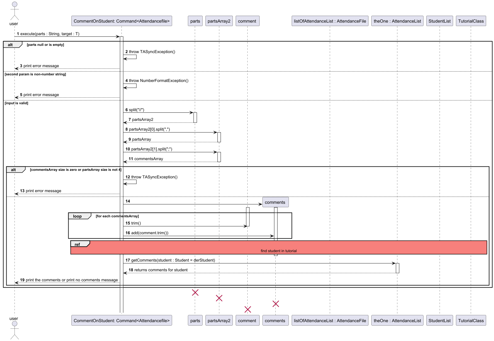
  - Extracts tutorial name, week number and student name and matric number from the given input.
  - Exception thrown if inputs are invalid.
  - The AttendancFile is searched to find the relevant AttendanceList
  - Exception is thrown and error message printed if none found.
  - This AttendanceList is then checked is it has a student with the same name and matric number is found.
  - Exception is thrown and error message printed if none found.
  - The elements of the ArrayList<String> associated with the student in the hashmap for students to comments is printed
  - A special message will be printed if this ArrayList is empty.

  - `Reference diagram`

#### 5.CommentOnStudentCommand
This is part of the Attendancelistcommands package,the function of this class is to add a comment(s) to a student in the particular tutorial and week.

#### Implementation details
This class implements the Command<AttendanceList> interface.Its function is to take in the input from the user and extract the tutorial,week and the student name and matric number
and their comments that the user has given and add all comments to the ArrayList containing all comments for a given student in the attendanceList for the given tutorial name and week.

#### Operations

- `CommentOnStudentCommand.execute()`
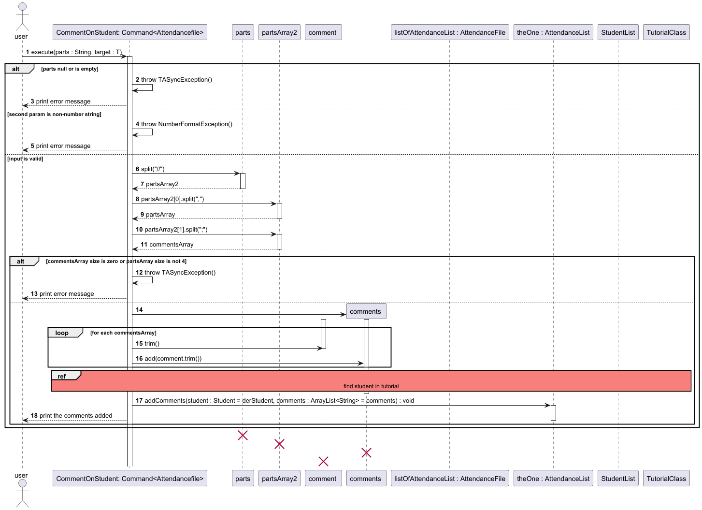

  - As seen in the diagram,the input from parts is split between data used to find the student and the comments to be added to the student and placed into a string array.
  - The relevant data is then extracted from each index and put into arrays.For the comments they are put into an ArrayList<String>
  - The attendanceFile is searched for an AttendanceList with the given Tutorial name and week number.
  - This AttendanceList is then searched for the student with the name and matric number.
  - The above 2 are located in the reference block highlighted in red.
  - The ArrayList<String> associated with the student in the hashmap for student comments have the given comments added to them.
  - The comments added will be printed out for the user to see.
  - As seen at the bottom,if an exception is thrown, an error message will be printed when an Exception is handled.
  - TASYNC exception will be thrown if the inputs do not follow the set form or has invalid inputs.It will also be thrown if the attendanceList cannot be found or the student cannot be found.

`find student in tutorial reference diagram`
#### 6.DeleteStudentCommentCommand
This is part of the Attendancelistcommands package,the function of this class is to remove a comment to a student in the particular tutorial and week.

#### Implementation details
This class implements the Command<AttendanceList> interface.Its function is to take in the input from the user and extract the tutorial,week and the student name and matric number
and the number position of the comment to be removed that the user has given and remove the comment in the ArrayList containing all comments for a given student in the attendanceList for the given tutorial name and week.

#### Operations
- `DeleteStudentCommentCommand.execute()`
  - Extracts tutorial name, week number , student name and matric number and the number position of the comment to be removed from the given input.
  - Exception thrown if no inputs, not enough inputs or too many inputs are given.
  - The AttendancFile is searched to find the relevant AttendanceList
  - Exception is thrown and error message printed if none found.
  - This AttendanceList is then checked is it has a student with the same name and matric number is found.
  - Exception is thrown and error message printed if none found.
  - The ArrayList<String> associated with the student that stores comments for the has the (num given - 1)th element removed.A message will then be printed stating that the comment was successfully deleted.
  - Different messages will be printed if the student has no comments associated with them or if the num given is outside the boundaries of the comments ArrayList.
  - An error message will be printed when an Exception is handled.
  - Sequence diagram is similar to 5 but instead at the end the comment is deleted and a message stating that it is deleted is printed,unless it dosent exist then nothing is deleted and a missing comment message will be printed.

#### 7.CreateNewAttendanceList
This is part of the Attendancelistcommands package,the function of this class is to create an AttendanceList for a particular tutorial and week.

#### Implementation details
This class implements the Command<ArrayList<Object>> interface.Its function is to take in the input from the user and extract the tutorial,week that the 
user has given create a new AttendanceList from it to add to the attendanceFile.The ArrayList will have the TutorialClassList as the first element and the 
AttendanceFile as the second element.

#### Operations
- `CreateNewAttendanceList.execute()`
  - Extracts tutorial name, week number for the new AttendanceList to be created from the given input.
  - Exception thrown if no inputs, not enough inputs , too many inputs are given or incorrect inputs.
  - The TutorialClassList is searched to find the relevant TutorialClass.
  - Exception is thrown and error message printed if none found.
  - The AttendanceFile is searched to find if it contains an AttendanceList for the given tutorial name and week.
  - A new AttendanceList would be created for the given tutorial name and week if none found.
  - Different message will be printed if the AttendanceList was found.
  - An error message will be printed when an Exception is handled.

  - Sequence diagram

### Marks Commands

#### 1. AddMarksCommand

The `AddMarksCommand` handles the addition of new marks to a given student's marksList.

#### Implementation Details

The `AddMarksCommand` class implements the `Command<TutorialClassList>` interface. It is responsible for parsing the input to 
extract the tutorial class code, student matriculation number, assignment name, marks achieved and maximum marks, validating them,
and instantiating and saving a Marks object with the details to the given student's marksList.

#### Operations

`AddMarksCommand#execute()`
- 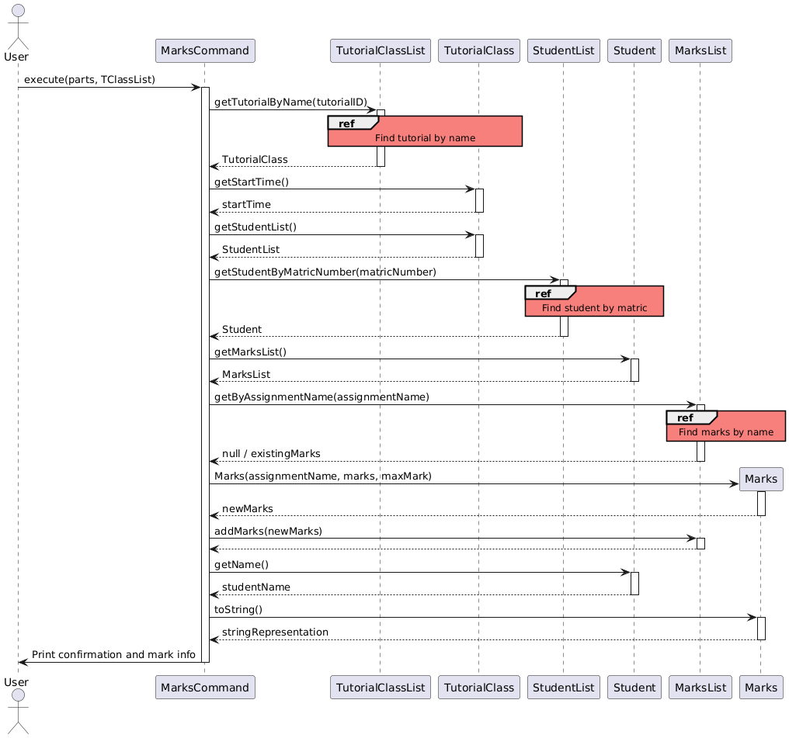
- - Reference diagrams provided at the end of this section.
- Validates the input to ensure it follows the expected format and is not missing arguments.
- Parses the input to extract the tutorial class code, matric number, assignment name, marks and maximum marks.
- Validates parsed inputs marks and maximum marks to make sure they are valid, non-negative integers with maximum marks >= marks.
- Retrieves the `tutorialClass` with the given tutorial class code.
- Checks if the `tutorialClass` retrieved exists, prints an error message otherwise.
- Retrieves the student with the given matric number from the retrieved `tutorialClass` student list.
- Checks if the student exists, prints an error message otherwise.
- Checks if the student's `marksList` already contains a marks object with the same assignment name, prints an error message if so.
- Instantiates the `marks` object with given assignment name, marks and max marks, and adds it to `marksList`.

### 2. DeleteMarksCommand

The `DeleteMarksCommand` handles the removal of a student's marks entry for a specified assignment.

### Implementation Details

The `DeleteMarksCommand` class implements the `Command<TutorialClassList>` interface. It is responsible for parsing the input  
to extract the tutorial class code, student matriculation number, and assignment name, validating them, and removing the  
corresponding `Marks` object from the student's `marksList`.

### Operations

#### `DeleteMarksCommand#execute()`
- 
- - Reference diagrams provided at the end of this section.
- Validates the input to ensure it follows the expected format and is not missing arguments.
- Parses the input to extract the tutorial class code, matric number, and assignment name.
- Retrieves the `TutorialClass` with the given tutorial class code.
- Checks if the `TutorialClass` exists, prints an error message otherwise.
- Retrieves the student with the given matric number from the retrieved `TutorialClass` student list.
- Checks if the student exists, prints an error message otherwise.
- Checks if the student's `marksList` contains a `Marks` object with the given assignment name, prints an error message if not.
- Removes the corresponding `Marks` object from the student's `marksList` and prints a success message.

### 3. ListMarksCommand

The `ListMarksCommand` handles retrieving and displaying all marks for a specified student.

### Implementation Details

The `ListMarksCommand` class implements the `Command<TutorialClassList>` interface. It is responsible for parsing the input  
to extract the tutorial class code and student matriculation number, validating them, and printing all marks recorded for  
the student.

### Operations

#### `ListMarksCommand#execute()`
- 
- - Reference diagrams provided at the end of this section.
- Validates the input to ensure it follows the expected format and is not missing arguments.
- Parses the input to extract the tutorial class code and matric number.
- Retrieves the `TutorialClass` with the given tutorial class code.
- Checks if the `TutorialClass` exists, prints an error message otherwise.
- Retrieves the student with the given matric number from the retrieved `TutorialClass` student list.
- Checks if the student exists, prints an error message otherwise.
- Prints the student's name followed by all marks recorded in their `marksList`.

#### Reference diagrams
1. 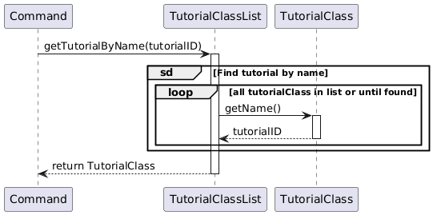
2. 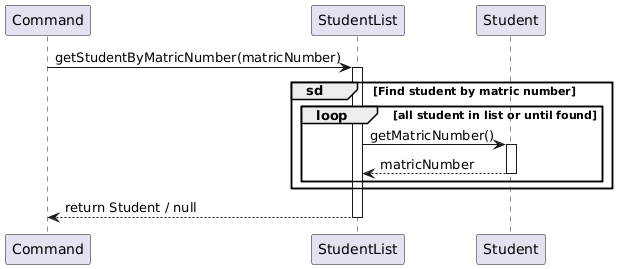
3. 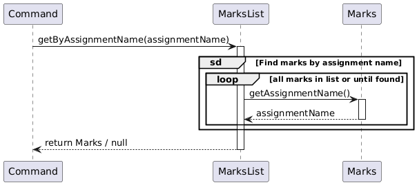

### Task Commands

#### 1. DeleteTaskCommand

The `DeleteTaskCommand` handles the removal of tasks from the system. It searches for the specified task by its number and removes it from the task list if found. If the task is not found, an error message is displayed.

#### Implementation Details

The `DeleteTaskCommand` class implements the `Command<TaskList>` interface and interacts with the `TaskList` to remove tasks.

#### Operations

`DeleteTaskCommand#execute()`
  - Retrieves the task to be deleted based on user input.
  - Removes the task from the `TaskList`.
  - Displays a confirmation message upon successful removal.
  - If the task is not found, an error message is shown.
  - Sequence diagram
  - 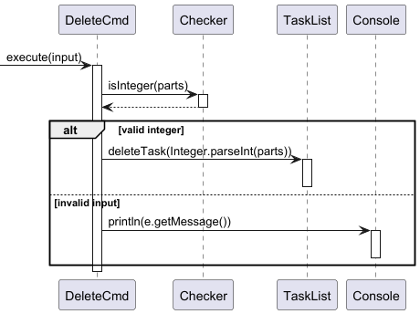

#### 2. ConsultationCommand
The `ConsultationCommand` handles the creation of a consultation task with specific timings. It requires the student's name along with `/from` and `/to` tags to specify the start and end times.

#### Implementation Details

The `ConsultationCommand` class implements the `Command<TaskList>` interface and interacts with the `TaskList` to add a new consultation task.

#### Operations

`ConsultationCommand#execute(String parts, TaskList taskList)`

- Parses the student name, start time, and end time from the user input.
- Ensures that both `/from` and `/to` tags are provided in the input.
- Validates the datetime format using `DateTimeFormatterUtil`.
- Creates a `Consultation` task and adds it to the `TaskList`.
- If the input format is incorrect, prompts the user to re-enter the command.
- Displays an error message if:
  - The `/from` or `/to` tags are missing.
  - The datetime format is incorrect.
  - Any input is missing.
- Sequence diagram
- 

#### 3. DeadlineCommand

The `DeadlineCommand` handles the creation of a task with a deadline. It requires a task description and a `/by` tag to specify the deadline.

#### Implementation Details

The `DeadlineCommand` class implements the `Command<TaskList>` interface and interacts with the `TaskList` to add a new deadline task.

#### Operations

`DeadlineCommand#execute(String parts, TaskList taskList)`

- Parses the task description and deadline from the user input.
- Ensures that the `/by` tag is provided in the input.
- Validates the deadline format using `DateTimeFormatterUtil`.
- Creates a `Deadline` task and adds it to the `TaskList`.
- If the input format is incorrect, prompts the user to re-enter the command.
- Displays an error message if:
  - The `/by` tag is missing.
  - The deadline format is incorrect.
  - Any input is missing.
- Sequence diagram
- 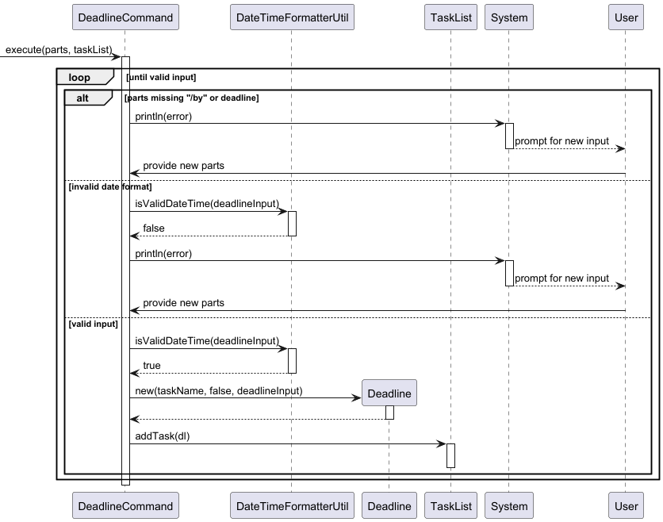

#### 4. EventCommand

The `EventCommand` handles the creation of a task with event timings. It requires a task description along with `/from` and `/to` tags to specify the start and end times.

#### Implementation Details

The `EventCommand` class implements the `Command<TaskList>` interface and interacts with the `TaskList` to add a new event task.

#### Operations

`EventCommand#execute(String parts, TaskList taskList)`

- Parses the task description, start time, and end time from the user input.
- Ensures that both `/from` and `/to` tags are provided in the input.
- Validates the datetime format using `DateTimeFormatterUtil`.
- Creates an `Event` task and adds it to the `TaskList`.
- If the input format is incorrect, prompts the user to re-enter the command.
- Displays an error message if:
  - The `/from` or `/to` tags are missing.
  - The datetime format is incorrect.
  - Any input is missing.
- Sequence diagram
- 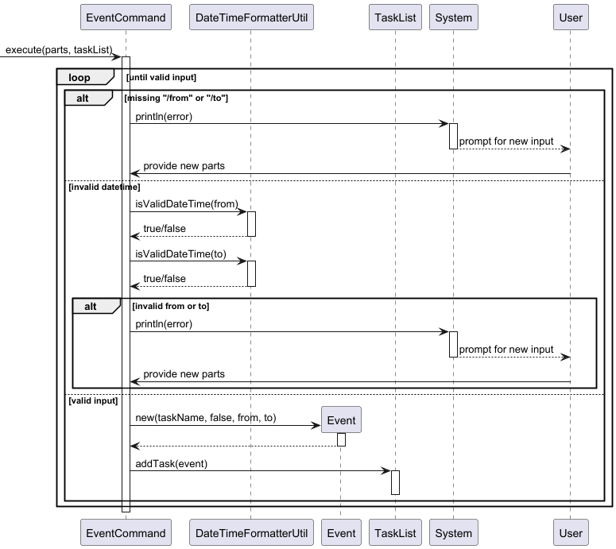

#### 5. TodoCommand

The `TodoCommand` handles the creation of a new todo task. It requires a task description as input.

#### Implementation Details

The `TodoCommand` class implements the `Command<TaskList>` interface and interacts with the `TaskList` to add a new todo task.

#### Operations

`TodoCommand#execute(String parts, TaskList taskList)`

- Parses the task description from the user input.
- Ensures that a non-empty description is provided.
- Creates a `Todo` task and adds it to the `TaskList`.
- Displays an error message if:
  - The task description is missing or empty.
- Sequence diagram
- 

#### 6. FindTaskCommand

The `FindTaskCommand` handles searching for tasks that contain a specified keyword. It retrieves and displays all matching tasks from the task list.

#### Implementation Details

The `FindTaskCommand` class implements the `Command<TaskList>` interface and interacts with the `TaskList` to search for tasks based on the given keyword.

#### Operations

`FindTaskCommand#execute(String parts, TaskList taskList)`

- Searches for tasks that contain the specified keyword.
- Retrieves a list of matching tasks using `taskList.getTaskListWithKeyWord(parts)`.
- If matching tasks are found, displays them to the user.
- Displays an error message if:
  - The keyword is missing or empty.
  - No matching tasks are found.
- Sequence diagram
- 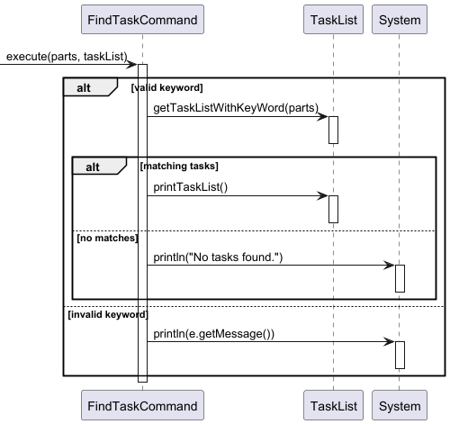

#### 7. ListTaskCommand

The `ListTaskCommand` handles displaying all tasks in the task list. If there are no tasks, it prints a message indicating that no tasks are available.

#### Implementation Details

The `ListTaskCommand` class implements the `Command<TaskList>` interface and interacts with the `TaskList` to retrieve and display tasks.

#### Operations

`ListTaskCommand#execute(String parts, TaskList taskList)`

- Retrieves all tasks from the `TaskList`.
- If tasks exist, prints the list of tasks to the user.
- If no tasks exist, displays the message: `noting to do yet`.
- The `parts` parameter is not used for this command.
- Sequence diagram
- 

#### 8. MarkTaskCommand

The `MarkTaskCommand` handles marking a task as completed. It requires a valid task number as input.

#### Implementation Details

The `MarkTaskCommand` class implements the `Command<TaskList>` interface and interacts with the `TaskList` to mark a specified task as done.

#### Operations

`MarkTaskCommand#execute(String parts, TaskList taskList)`

- Validates whether the provided input is a valid integer using `IntegerChecker.isInteger(parts)`.
- Converts the input to an integer and marks the corresponding task as done using `taskList.markTaskAsDone(taskNumber)`.
- Displays an error message if:
  - The input is not a valid task number.
  - The task number does not exist in the list.
- Sequence diagram
- 

#### 9. UnmarkTaskCommand

The `UnmarkTaskCommand` handles marking a task as undone. It requires a valid task number as input.

#### Implementation Details

The `UnmarkTaskCommand` class implements the `Command<TaskList>` interface and interacts with the `TaskList` to mark a specified task as undone.

#### Operations

`UnmarkTaskCommand#execute(String parts, TaskList taskList)`

- Validates whether the provided input is a valid integer using `IntegerChecker.isInteger(parts)`.
- Converts the input to an integer and marks the corresponding task as undone using `taskList.markTaskAsUndone(taskNumber)`.
- Displays an error message if:
  - The input is not a valid task number.
  - The task number does not exist in the list.
- Sequence diagram
- 

#### 10. RenameTaskCommand

The `RenameTaskCommand` handles renaming a task. It requires a task number and the new task name.

#### Implementation Details

The `RenameTaskCommand` class implements the `Command<TaskList>` interface and interacts with the `TaskList` to rename a specified task.

#### Operations

`RenameTaskCommand#execute(String parts, TaskList taskList)`

- Parses the task number and the new task name from the user input.
- Renames the specified task in the `TaskList` using `taskList.renameTask(taskNumber, newTaskName)`.
- Displays an error message if:
  - The input is missing the task number or new task name.
  - The task number format is invalid.
  - The task number does not exist in the list.
- Sequence diagram
- 

Overall class diagram for task commands
- This class diagram provides a **high-level overview** of the command-based structure used in the task management system. It illustrates how different task-related commands interact with the `TaskList` and the task types it contains.
  - Any class implementing `Command` must define how to execute a command using a String argument and a target of type `T`. Here, all concrete classes implement `Command<TaskList>`, meaning they operate on the `TaskList`.
  - Task creation commands: `TodoCommand`, `DeadlineCommand`, `EventCommand`, `ConsultationCommand`. These create new tasks and add them to the `TaskList`.
  - Task operation commands: `ListTaskCommand`, `DeleteTaskCommand`, `MarkTaskCommand`, `UnmarkTaskCommand`, `FindTaskCommand`, `RenameTaskCommand`. These interact with existing tasks in the `TaskList`.
- 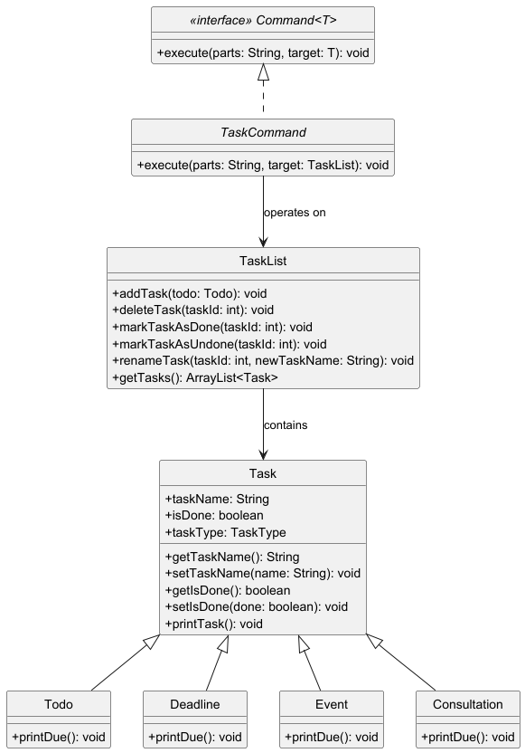
  
Object diagram for todo command
- This object diagram illustrates how the `TodoCommand` operates when the `execute()` method is invoked. In the example, the command creates a new Todo object with a description and adds it to the `TaskList`. The interaction shown highlights the following:

  - A `TodoCommand` object calls its `execute()` method with a task description (e.g., `"read book"`).

  - The method instantiates a new `Todo` task with the given description and a default `isDone` status of `false`.

  - This `Todo` object is then added to the `TaskList`, which holds a collection of `Task` objects.

  - This structure serves as a representative example of how similar commands like `DeadlineCommand`, `EventCommand`, and `ConsultationCommand` work, since they also involve creating a specific task type and adding it to the task list.
- 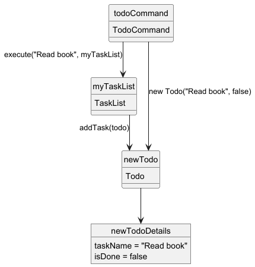

Object diagram for list task command
- This object diagram shows how the `ListTaskCommand` functions when its `execute()` method is called. It represents the scenario where a command queries and displays all tasks in the task list:

  - The `ListTaskCommand` object calls `execute()` with an empty string (as the command does not require any input).

  - It accesses the `TaskList`, checks the task count using `getTaskCount()`, and prints the list of existing tasks via `printTaskList()`.

  - The diagram also includes sample `Task` objects (`Todo`, `Deadline`) that are stored within the task list, each with attributes such as `taskName` and `isDone`.

  - This example reflects how other commands such as `DeleteTaskCommand`, `MarkTaskCommand`, `UnmarkTaskCommand`, `FindTaskCommand`, and `RenameTaskCommand` work in a similar fashion. These commands typically interact with the existing tasks in the list, often by using task indices or names to perform updates or queries, rather than creating new tasks.
- 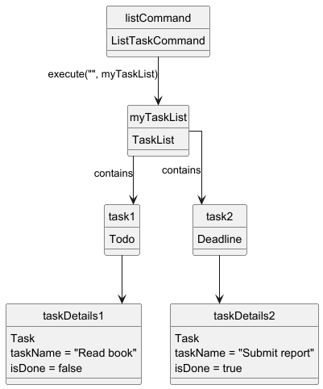
## Appendix A: Product scope
### Target user profile

Our target users are teaching assistants (TAs) and tutors who manage both student-related administrative tasks and personal workload. They often handle responsibilities like tracking attendance, recording remarks, and planning tutorials, requiring an efficient way to stay organized. These users are comfortable with command-line interfaces (CLI) and prefer automation to manual data entry, seeking a tool that integrates smoothly into their workflow without the overhead of graphical applications.

### Value proposition

Teaching assistants and tutors often struggle with time-consuming administrative tasks which can be tedious and inefficient with traditional tools. Our CLI-based solution streamlines these processes, offering a fast, automated, and distraction-free way to manage academic responsibilities. By eliminating the need for GUI-based software, it enhances productivity and reduces manual effort.

## Appendix B: User Stories

| Version | As a ...                       | I want to ...                                                                          | So that I can ...                                                                            |
|---------|--------------------------------|----------------------------------------------------------------------------------------|----------------------------------------------------------------------------------------------|
| v1.0    | inexperienced or new TA        | know how to use TASync easily by referring to a readily accessible built-in user guide | quickly learn how to use the application and avoid mistakes when interacting with the system |
| v1.0    | TA                             | edit (add/delete) the student list                                                     | track who is in my class and ensure accurate attendance records                              |
| v1.0    | TA                             | mark attendance for tutorial sessions                                                  | keep track of student attendance to ensure participation                                     |
| v1.0    | TA                             | create weekly tutorial attendance list                                                 | organize attendance per session and quickly reference past attendance records                |
| v1.0    | TA after each session          | add remarks for the student after each tutorial                                        | refer back to feedback for future sessions and provide constructive comments                 |
| v1.0    | TA with lots of classes        | find students in my tutorials easily                                                   | quickly locate students and manage tutorial-related activities                               |
| v1.0    | TA after each session          | give remarks on my students for future reference                                       | provide personalized feedback to students for future reference and improvement               |
| v1.0    | TA managing multiple tutorials | list out my tutorial classes for a specified amount of time                            | view my scheduled tutorials over a period of time for better planning                        |
| v1.0    | busy TA                        | add consultation slots into the list of todo                                           | show when my consultation slots are and manage my time effectively                           |
| v1.0    | busy TA                        | find a task by name                                                                    | locate a task without having to go through the entire list                                   |
| v2.0    | busy TA                        | schedule and modify my teaching schedules                                              | accommodate student consultations/meetings with professors and stay organized                |
| v2.0    | busy TA                        | print out tutorial + tasks on the particular day once the app is opened                | quickly view my teaching schedule and tasks for the day upon opening the app                 |
| v2.0    | responsible TA                 | track a student’s individual assignment grades                                         | monitor grades for students to provide timely feedback                                       |

## Appendix C: Non-Functional Requirements

1. Should work on any _mainstream OS_ with Java 17 installed.
2. All commands should be executable in English text, using only keyboard and no other input devices.
3. A user with above average typing speed for regular English text (i.e. not code, not system admin commands) should
be able to accomplish most tasks using commands faster than using the mouse.
4. Should be able to hold up to 1000 students without any noticeable sluggishness in performance for typical usage.
5. Data must be stored locally in human-editable file formats.

## Appendix D: Glossary

* *CLI* - Command Line Interface
* *GUI* - Graphical User Interface
* *Mainstream OS* - Windows, Linux, Unix, macOS
* *TA* - Teaching Assistants
* *Matriculation/Matric number* - Unique student identification string for NUS students

## Appendix E: Instructions for manual testing

### Initial launch:
1. Download the latest .jar file and place it in an empty folder. This will be used as the working directory.
2. Navigate to the working directory in a terminal window.
3. Run the command `java -version` to ensure your system is running Java 17.
4. To launch the app, run `java -jar "tp.jar"` in the working directory. If successful, TASync will print a
welcome message, and will be ready to accept commands.
5. The `/data` folder and required save files will be created in the working folder.

### Setup: Adding sample data
1. Use `NEWTUTORIAL -t` to create empty tutorial classes.
2. Use `NEWSTUDENT -t` to add sample students to the created tutorial classes.
3. Use `CREATE -at` to create attendance lists for the created tutorial classes.

*The following sections provide sample test cases, indicating the expected outputs for valid and invalid commands,
intended to provide a logical path through all user-testable features. The test cases are not exhaustive, and further
variations in test cases are required for extensive testing.*

### Tutorial commands

#### Creating a new tutorial
1. Test case: `NEWTUTORIAL -t T123,2,11:00,13:00`
- Expected: Tutorial successfully created.
2. Test case: `NEWTUTORIAL -t T02,9,11:00,13:00`
- Expected: Error message indicating invalid day of week.
3. Other incorrect inputs to test: Invalid time formats.

#### Deleting a tutorial/Listing students for a tutorial
1. Test cases: `DELETE -t T123`
- Expected: Tutorial is successfully deleted.
2. Test cases: `LISTSTUDENTS -t T123`
- Expected: All students in the given tutorial, and their information, listed.
3. Incorrect inputs to test: Missing arguments, invalid tutorial.

#### Listing tutorials
1. Test case: `LIST -t 12/04/2025`
- Expected: Lists all tutorials from today to given date.
2. Test case: 'LIST -t 12-4'
- Expected: Error message for invalid date format.
3. Other incorrect inputs to test: Invalid dates, such as date in the past.

### Student commands
#### Adding a new student
1. Test case: `newstudent -t Mark Lim,20/03/2005,Male,97654344,A2387653D,T123`
- Expected: New student with given details is successfully created and added to student list for tutorial T123.
2. Test case: `newstudent -t Mark Lim` 
- Expected: Error message indicating that command does not follow format. No student created or added to any tutorial.
3. Other incorrect inputs to test: Incorrect date formats, invalid genders, non-existent tutorial class.
- Expected: Similar as above.

#### Deleting a student
1. Test case: `deletestudent -t T123, A2387653D`
- Expected: Student with given matric number is no longer in student list for tutorial T123.
2. Test case: `deletestudent -t INVALID_TUT, A0123`
- Expected: Error message indicating an invalid tutorial name.
2. Incorrect inputs to test:
* Attempting to delete non-existent student.
* Attempting to delete from non-existent tutorial.
- Expected: Error message, no change to any student lists for any tutorial.

#### Checking the remark of a student
1. Test case: `CHECKREMARK -t T123, A234567W`
- Expected: Prints the remark for the student with given matric number in T123.
2. Incorrect inputs to test: Similar to `DELETESTUDENT -t`
- Expected: Error message indicating invalid command.

#### Change the remark of a student
1. Test case: `CHANGEREMARK -t T123,A2345674W,Excellent job in class!`
- Expected: Remark of student is successfully "Excellent job in class!"
2. Incorrect inputs to test: Missing arguments, non-existent tutorial/matric, etc.
- Expected: Error message indicating invalid command.

#### Finding a student
1. Test case: `find -t A0123`
- Expected: Prints details of any student with matric number containing A0123.
2. Test case: `find -t song`
- Expected: Prints details of any student with name containing John, e.g. Charlie Song.
3. Incorrect inputs to test:
* Keyword such that no matching student exists.
- Expected: Error message for incorrect format or message indicating no match.

### Marks Commands

#### Adding and deleting marks
1. Test case: `NEWMARKS -m T123,A1234567W,Midterm Exam,75,100`
- Expected: Marks with given details successfully added to student's marks list and visible when listed.
2. Test case: `NEWMARKS -m T123,A1234567W,Quiz,-1,-20`
- Expected: Error message indicating invalid marks, no marks created.
3. Test case: `DELETEMARKS -m T123,A1234567W,Midterm Exam`
- Expected: Marks with assignment name deleted from given student's marks list and no longer visible when listed.
4. Test case: `DELETEMARKs -m T123, A1234567W, INVALID_ASSIGNMENT`
- Expected: Error message indicating no match for the assignment name.
5Other incorrect inputs to test:
* Invalid tutorial, matric numbers.
* Non-numerical marks, or invalid marks e.g. negative marks.
- Expected: Error message, no marks added.

#### Listing marks
1. Test case: `LIST -m T123, A1234567W`
- Expected: All assignments and marks printed, followed by an average percentage for the student.
2. Incorrect inputs to test:
* Invalid tutorial or matric number, missing arguments.

### Attendance commands

#### Creating an attendance list
1. Test case: `CREATE -at T01, 1`
- Expected: Creates an attendance list with given details if it does not already exist.
2. Test case: `CREATE -at T01, -1`
- Expected: Error message indicating invalid week.
3. Other invalid inputs to test: Invalid tutorial name.

#### Listing attendance for a given tutorial session
1. Test case: `LIST -a T01, 1`
- Expected: Prints list of students, with their matric number and present/absent.
2. Test case: `LIST -a T01, 0`
- Expected: Error message indicating invalid week.
3. Other invalid inputs to test: Attempt to list for invalid tutorial or week without attendance list created.

#### Marking/Unmarking attendance, viewing comments
1. Test cases: `MARK -a T01,1,John,A0123456A`, `UNMARK -a T01,1,John,A0123456A`, `VIEWCOMMENT -a T01,1,John,A0123456A`
- Expected: Student is marked or unmarked as present/All comments for student are printed.
2. Test case: `MARK -a T01,1,John,INVALID_MATRIC`
- Expected: Error message indicating an invalid matric number.
3. Other incorrect inputs to test:
* Name and matric number not matching.
* Attendance list not created in the given week.

#### Adding comments
1. Test case: `COMMENT -a T01,1,john,A0123456A//John is punctual`
- Expected: Comment "John is punctual" added to list of comments.
2. Test case: `COMMENT -a T01,1,john,A0123456A, John is punctual`
- Expected: Error message indicating invalid format.
3. Other incorrect inputs to test:
* Multiple comments not separated by ;
* Invalid tutorial, name and matric number combinations.
* Attendance list not created in the given week.

### Task commands

#### Adding tasks
1. Test cases: 
* `ADD -pt todo task`
* `ADD -pd submission /by 03/04/2025 23:59`
* `ADD -pe lab /from 03/04/2025 15:00 /to 03/04/2025 16:00`
* `ADD -c Kevin /from 05/04/2025 15:00 /to 05/04/2025 16:00`
- Expected: Message indicating task with given details successfully added, updated task count. List using `LIST -p` shows new task.
2. Test case: `ADD -pt`
- Expected: Error message indicating invalid format.
3. Other incorrect inputs to test:
* Invalid date time formats.
* Invalid date time combinations, e.g. deadline in the past.

#### Deleting, marking/unmarking and renaming tasks
* Prerequisite: View the list of tasks using `LIST -p` to see task index numbers.
1. Test cases: `DELETE -p 3`, `MARK -p 1`, `UNMARK -p 5`, `RENAME -p 2 study python`
- Expected: Task at given index number successfully deleted/marked/unmarked/renamed, visible in list.
2. Test case: `MARK -p 100`
- Expected: Message indicating no task at given index.
3. Other incorrect inputs to test:
* Non-numerical index number.
* Invalid index, e.g. negative index.
- Expected: Error message indicating invalid index.

#### Finding a task
1. Test case: `FIND -p python`
- Expected: All tasks in list with description containing "python" are printed.
2. Test case: `FIND -p INVALID_KEYWORD`
- Expected: Message indicating no matches found.

### Saving data
#### Deleting save files
Save files can be deleted from the /data folder.
- Expected: A blank save file is created when TASync runs next, replacing the deleted file.

#### Tampering with save files
Save files are in human-editable format, and can thus be opened and modified with text editors.
1. Saved text data is deleted/changed to invalid formats.
- Expected: The saved data (tutorial/attendance/student/task/marks) in invalid format is not loaded. Corrupted data is deleted the next time 
TASync saves data.
2. Saved text data is modified, but data is still valid and correctly formatted.
- Expected: The modified data is successfully loaded when TASync runs next.

